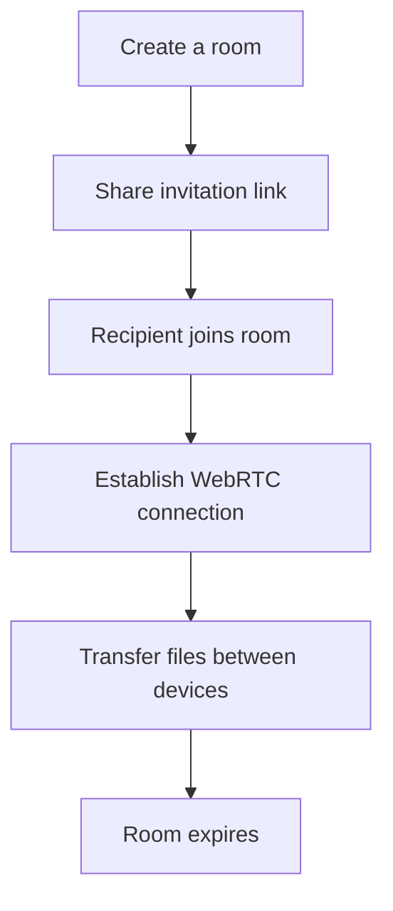

# Droply

<div align="center">


Temporary. Peer-to-peer. No permanent copies.

[](https://github.com/NiranjanD0/droply/stargazers)
[](https://github.com/NiranjanD0/droply/blob/main/LICENSE)
[](https://github.com/NiranjanD0/droply/issues)
[](https://github.com/NiranjanD0/droply/commits/main)
[](https://webrtc.org/)


</div>

---

## Overview

**Droply** is a temporary, peer-to-peer file-sharing platform designed to make sharing files between devices simple and convenient.

Create a room, share its invitation link, connect with another device, and transfer files directly between browsers using WebRTC whenever a direct connection is possible.

Unlike traditional file-sharing services, Droply is designed around temporary sessions rather than permanent file hosting. Rooms are short-lived and disappear when their session expires.

No permanent file storage. No unnecessary copies. Just file sharing.

## How It Works



When a direct peer-to-peer connection cannot be established, a TURN relay may be required to carry the traffic.

## Features

### File Sharing

* **Peer-to-peer transfers:** Transfer files directly between connected browsers using WebRTC.
* **Temporary rooms:** Create short-lived rooms for sharing files without permanent hosting.
* **Room-based sharing:** Invite participants using a room code or invitation link.
* **Participant limits:** Configure the maximum number of participants in a room.
* **Optional password protection:** Restrict room access with a password.

### Privacy & Access Control

* **Room access settings:** Configure who can join a room.
* **Participant privacy:** Options for hiding participant names.
* **File name privacy:** Options for hiding file names from uninvolved participants.
* **Room lifecycle controls:** Configure room behavior when the host leaves.
* **Temporary sessions:** Rooms are designed to disappear after their session expires.

### Communication

* **In-room chat:** Allow participants to communicate during a file-sharing session.
* **Room management:** Manage access and participant settings from within the room.

> Feature availability depends on the current implementation. Some options may still be under development.

## Architecture

Droply uses a web-based architecture built around temporary room sessions and peer-to-peer communication.

| Component          | Technology   | Purpose                    |
| ------------------ | ------------ | -------------------------- |
| Frontend           | Next.js      | Application framework      |
| UI                 | React        | User interface             |
| Language           | TypeScript   | Type safety                |
| Styling            | Tailwind CSS | Interface styling          |
| Session management | Supabase     | Room state and signaling   |
| File transfer      | WebRTC       | Peer-to-peer communication |
| Hosting            | Vercel       | Application deployment     |

### File Transfer Flow

1. A host creates a room.
2. The room generates an invitation link that can be shared with participants.
3. Participants join the room and exchange connection information through the signaling system.
4. WebRTC establishes a peer-to-peer connection when possible.
5. Files are transferred between connected peers without being permanently stored by Droply.
6. The room is removed when its session expires.

WebRTC may use a TURN relay when direct connectivity is unavailable. A relay can carry file traffic, so not every transfer is guaranteed to travel directly between devices.

## Getting Started

### Prerequisites

* Node.js
* npm
* A Supabase project

### Installation

**1. Clone the repository**

```bash
git clone https://github.com/NiranjanD0/droply.git
cd droply
```

**2. Install dependencies**

```bash
npm install
```

**3. Configure environment variables**

Create a `.env.local` file in the project root:

```env
NEXT_PUBLIC_SUPABASE_URL=your_supabase_url
NEXT_PUBLIC_SUPABASE_ANON_KEY=your_supabase_anon_key
```

Use the variable names expected by your application. Never expose Supabase service-role keys or other private credentials in client-side code.

**4. Start the development server**

```bash
npm run dev
```

**5. Open the application**

Visit http://localhost:3000 in your browser.

## Project Structure

```text
droply/
├── app/
│   ├── globals.css
│   ├── layout.tsx
│   └── page.tsx
├── components/
│   ├── anima/
│   ├── ui/
│   ├── FeaturesShowcase.tsx
│   ├── Hero.tsx
│   ├── Notifications.tsx
│   └── RoomSettings.tsx
├── lib/
├── public/
│   └── assets/
│       ├── fonts/
│       └── images/
├── LICENSE
├── package.json
├── README.md
└── tsconfig.json
```

> This is a suggested structure. Adjust it to match the actual repository layout.

## Privacy & Security

Droply is designed to support temporary file sharing without permanent file hosting.

* File transfers are intended to use peer-to-peer connections where possible.
* Room access is managed through room settings and session controls.
* Temporary rooms are designed to expire rather than remain available indefinitely.
* Droply does not review or endorse files shared by users.

**Privacy note:** Peer-to-peer communication does not automatically guarantee complete privacy. Connection setup, signaling, relay usage, access controls, and application security all affect how data is handled.

## Roadmap

* [ ] Complete room creation and joining flows
* [ ] Implement WebRTC file transfers
* [ ] Implement room access controls
* [ ] Add password-protected rooms
* [ ] Implement participant approval and room locking
* [ ] Add privacy controls for names and file names
* [ ] Implement automatic room expiration
* [ ] Add in-room chat
* [ ] Improve connection reliability with TURN support
* [ ] Optimize the interface for mobile devices
* [ ] Add comprehensive tests and documentation

## Contributing

Contributions, bug reports, and feature suggestions are welcome.

1. Fork the repository.

2. Create a feature branch:

   ```bash
   git checkout -b feature/your-feature
   ```

3. Commit your changes.

4. Push your branch.

5. Open a pull request describing your changes.

For bugs and feature requests, open an issue in the repository.

## License

This project is licensed under the MIT License. See [LICENSE](LICENSE) for details.

---

<div align="center">

**Droply** · Share files, not permanent copies.

Made with 👻

</div>
